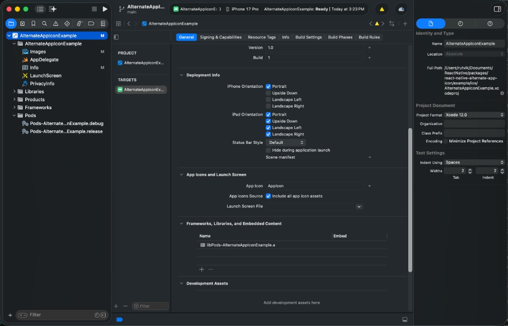

[](https://www.npmjs.com/package/react-native-alternate-app-icon)
[](https://www.npmjs.com/package/react-native-alternate-app-icon)
[](https://github.com/rutvik24/react-native-alternate-app-icon)
[](https://github.com/rutvik24/react-native-alternate-app-icon/blob/main/LICENSE)

# React Native Alternate App Icon | App Icon Changer

`react-native-alternate-app-icon` is a high-performance **App Icon Changer for React Native** that allows you to dynamically change your app's icon at runtime on **iOS** and **Android**. Built with [Nitro Modules](https://nitro.margelo.com), it provides a type-safe JavaScript API backed by native Swift and Kotlin implementations.

Use it as a **dynamic app icon changer** for seasonal themes, event-based branding, user personalization, or any scenario where you want to switch icons without shipping a new build.

📖 **[Full documentation](https://rutvik24.github.io/react-native-alternate-app-icon/)** — guides, API reference, and platform setup.

## For AI agents (Cursor, Claude Code, Copilot, …)

Install the agent skill so coding agents follow correct iOS/Android setup and API usage:

```bash
npx skills add rutvik24/react-native-alternate-app-icon -g -y
```

Docs: [For AI agents](https://rutvik24.github.io/react-native-alternate-app-icon/docs/agents/overview) · [Install skill](https://rutvik24.github.io/react-native-alternate-app-icon/docs/agents/skill) (per-provider **Add to Cursor** and other agents)

## Key Features

- **Alternate App Icon Management** — Change your app icon at runtime on iOS and Android.
- **Cross-Platform API** — Same JavaScript functions work on both platforms.
- **Nitro-Powered** — Fast native bindings via [react-native-nitro-modules](https://github.com/mrousavy/nitro).
- **New Architecture Ready** — Works with React Native's New Architecture (Fabric & TurboModules).
- **Event-Based Switching** — Change icons based on holidays, promotions, user preferences, and more.

## Compatibility

| Requirement | Version |
| --- | --- |
| `react-native-alternate-app-icon` | **0.8.0+** (latest recommended) |
| `react-native-nitro-modules` | **0.32.0** (peer dependency; pin this version) |
| React Native | **0.76.0** or higher |
| Node.js | **18.0.0** or higher |

Native bindings in this library are generated with [Nitrogen](https://github.com/mrousavy/nitro) **0.32.0** for the Nitro Modules **0.32.x** Android/iOS APIs. Use a matching `react-native-nitro-modules` version in your app—mixing Nitro **0.35+** with a build targeting **0.32.x** can cause native compile errors.

See the [compatibility guide](https://rutvik24.github.io/react-native-alternate-app-icon/docs/getting-started/compatibility) for details.

## Installation

Install the package along with its peer dependency (pin Nitro to **0.32.0**):

```bash
bun add react-native-alternate-app-icon react-native-nitro-modules@0.32.0
```

For iOS, install CocoaPods dependencies:

```bash
bundle exec pod install --project-directory="ios"                                                                                                                                                                
```

---

## iOS Setup

### 1. Directory Structure

Add your primary and alternative icons inside `Images.xcassets`:

```
Images.xcassets
├── AppIcon.appiconset
│   ├── Contents.json
│   └── ... (icon images)
└── AlternativeIcon.appiconset
    ├── Contents.json
    └── ... (icon images)
```

Each alternative icon needs its own `.appiconset` folder. The folder name (e.g. `AlternativeIcon`) is the name you pass to `setIcon()`.

> **Tip:** You can use Xcode's asset catalog to generate all required sizes, or provide a single 1024×1024 universal icon:

```json
{
  "images": [
    {
      "filename": "alternate.png",
      "idiom": "universal",
      "platform": "ios",
      "size": "1024x1024"
    }
  ],
  "info": {
    "author": "xcode",
    "version": 1
  }
}
```

### 2. Update `Info.plist`

Add `CFBundleIcons` to define your primary and alternate icons:

```xml
<key>CFBundleIcons</key>
<dict>
  <key>CFBundlePrimaryIcon</key>
  <dict>
    <key>CFBundleIconFiles</key>
    <array>
      <string>AppIcon</string>
    </array>
  </dict>
  <key>CFBundleAlternateIcons</key>
  <dict>
    <key>AlternativeIcon</key>
    <dict>
      <key>CFBundleIconFiles</key>
      <array>
        <string>AlternativeIcon</string>
      </array>
    </dict>
  </dict>
</dict>
```

- **Primary icon:** The key under `CFBundleIconFiles` must match your primary `.appiconset` name (e.g. `AppIcon`).
- **Alternative icons:** Add one entry per alternate icon under `CFBundleAlternateIcons`. The key (e.g. `AlternativeIcon`) is the name passed to `setIcon()`.

### 3. Configure Xcode

1. Open your project in Xcode.
2. Go to **General → App Icons and Launch Screen**.
3. Set **App Icon** to your default icon set (e.g. `AppIcon`).
4. Under **App Icons Source**, enable **Include all app icon assets**.

[](./assets/screenshots/xcode-app-icons-source.png)

> The **Include all app icon assets** checkbox bundles every icon set from your asset catalog so alternate icons are available at runtime.

### Demo

<p align="center">
  <video
    src="https://raw.githubusercontent.com/rutvik24/react-native-alternate-app-icon/main/assets/alternate-app-icon-iOS.MP4"
    width="400"
    autoplay
    loop
    muted
    playsinline
    controls
  />
</p>

---

## Android Setup

Android uses `activity-alias` entries in `AndroidManifest.xml`. Each alias maps to a launcher icon and corresponds to an icon name used in JavaScript.

### 1. Add Icon Assets

Place launcher icons in your `mipmap-*` resource folders. Use consistent naming across all density folders:

```
app/src/main/res/
├── mipmap-mdpi/
│   ├── ic_launcher_alternate.png
│   └── ic_launcher_alternate_round.png
├── mipmap-hdpi/
│   ├── ic_launcher_alternate.png
│   └── ic_launcher_alternate_round.png
├── mipmap-xhdpi/
│   ├── ic_launcher_alternate.png
│   └── ic_launcher_alternate_round.png
├── mipmap-xxhdpi/
│   ├── ic_launcher_alternate.png
│   └── ic_launcher_alternate_round.png
├── mipmap-xxxhdpi/
│   ├── ic_launcher_alternate.png
│   └── ic_launcher_alternate_round.png
└── mipmap-anydpi-v26/
    ├── ic_launcher_alternate.xml
    └── ic_launcher_alternate_round.xml
```

> **Tip:** Use Android Studio's **Image Asset Studio** (File → New → Image Asset) to generate all required sizes.

### 2. Configure `AndroidManifest.xml`

Add `activity-alias` entries for each icon variant. The suffix after `MainActivity` in the alias name becomes the icon name in JavaScript:

| Alias name                     | Icon name for `setIcon()` |
| ------------------------------ | ------------------------- |
| `.MainActivityDefault`         | `"Default"`               |
| `.MainActivityAlternativeIcon` | `"AlternativeIcon"`       |

```xml
<application
  android:name=".MainApplication"
  android:label="@string/app_name"
  android:icon="@mipmap/ic_launcher"
  android:roundIcon="@mipmap/ic_launcher_round"
  ...>

  <activity
    android:name=".MainActivity"
    android:label="@string/app_name"
    android:launchMode="singleTask"
    android:exported="true">
    <intent-filter>
      <action android:name="android.intent.action.MAIN" />
      <category android:name="android.intent.category.LAUNCHER" />
    </intent-filter>
  </activity>

  <activity-alias
    android:name="${applicationId}.MainActivityDefault"
    android:targetActivity=".MainActivity"
    android:icon="@mipmap/ic_launcher"
    android:roundIcon="@mipmap/ic_launcher_round"
    android:label="@string/app_name"
    android:enabled="false"
    android:exported="true">
    <intent-filter>
      <action android:name="android.intent.action.MAIN" />
      <category android:name="android.intent.category.LAUNCHER" />
    </intent-filter>
  </activity-alias>

  <activity-alias
    android:name="${applicationId}.MainActivityAlternativeIcon"
    android:targetActivity=".MainActivity"
    android:icon="@mipmap/ic_launcher_alternate"
    android:roundIcon="@mipmap/ic_launcher_alternate_round"
    android:label="@string/app_name"
    android:enabled="false"
    android:exported="true">
    <intent-filter>
      <action android:name="android.intent.action.MAIN" />
      <category android:name="android.intent.category.LAUNCHER" />
    </intent-filter>
  </activity-alias>

</application>
```

> **Note:** On Android, icon changes are applied when the app moves to the background. The library handles this automatically and defers the switch if OAuth or other overlay activities are active.

### ProGuard / R8 (release builds)

The library ships **consumer ProGuard rules** in its AAR (`android/consumer-rules.pro`). When you enable `minifyEnabled true` for release, those rules merge automatically — you do not need to copy Nitro keep rules into your app.

Use `proguard-android-optimize.txt` and avoid redundant `-keep` rules for `Activity` or `activity-alias` (manifest components are kept by R8).

Full guide: [ProGuard / R8](https://rutvik24.github.io/react-native-alternate-app-icon/docs/android/proguard)

### Demo

<p align="center">
  <video
    src="https://raw.githubusercontent.com/rutvik24/react-native-alternate-app-icon/main/assets/alternate-app-icon-android.webm"
    width="400"
    autoplay
    loop
    muted
    playsinline
    controls
  />
</p>

---

## Usage

Import the functions you need:

```javascript
import {
  getActiveIcon,
  setIcon,
  getAllAlternativeIcons,
  resetIcon,
} from 'react-native-alternate-app-icon'
```

You can also access the underlying Nitro hybrid object directly:

```javascript
import { AlternateAppIcon } from 'react-native-alternate-app-icon'
```

### `setIcon(iconName: string): Promise<string>`

Sets the app icon to the specified name. Pass `"Default"` to revert to the primary icon.

```javascript
await setIcon('AlternativeIcon')
// => "Icon changed to AlternativeIcon" (iOS)
// => "Your icon will change to AlternativeIcon" (Android — applied on background)

await setIcon('Default')
```

### `getActiveIcon(): Promise<string>`

Returns the name of the currently active icon. Returns `"Default"` when the primary icon is active.

```javascript
const activeIcon = await getActiveIcon()
console.log('Current active icon:', activeIcon)
```

### `getAllAlternativeIcons(): Promise<string[]>`

Returns all available icon names configured in your project.

```javascript
const icons = await getAllAlternativeIcons()
console.log('Available icons:', icons)
// => ["Default", "AlternativeIcon"]
```

### `resetIcon(): Promise<string>`

Resets the app icon to the primary/default icon.

```javascript
const message = await resetIcon()
console.log(message)
// => "Icon reset to default."
```

### Full Example

```javascript
import React, { useEffect, useState } from 'react'
import { Button, Text, View } from 'react-native'
import {
  getActiveIcon,
  getAllAlternativeIcons,
  resetIcon,
  setIcon,
} from 'react-native-alternate-app-icon'

export default function App() {
  const [activeIcon, setActiveIcon] = useState('')
  const [icons, setIcons] = useState([])

  useEffect(() => {
    ;(async () => {
      setActiveIcon(await getActiveIcon())
      setIcons(await getAllAlternativeIcons())
    })()
  }, [])

  return (
    <View>
      <Text>Active icon: {activeIcon}</Text>
      {icons.map((icon) => (
        <Button
          key={icon}
          title={`Set ${icon}`}
          onPress={() => setIcon(icon)}
        />
      ))}
      <Button title="Reset icon" onPress={resetIcon} />
    </View>
  )
}
```

See the [example app](./example) for a complete working project.

---

## Platform Notes

### iOS

- Alternate icons require a physical device or simulator running iOS 10.3+.
- iOS shows a system alert when the icon changes — this is expected behavior.
- The icon name must match a key in `CFBundleAlternateIcons`, or use `"Default"` for the primary icon.

### Android

- Icon names are derived from `activity-alias` names: everything after `MainActivity` in the alias class name.
- The icon switch is deferred until the app is backgrounded for a smoother UX.
- The library automatically waits if sign-in, OAuth, or other overlay activities are in the foreground.

---

## Contributing

Contributions are welcome! Please read:

- [Contributing guide](./CONTRIBUTING.md) — setup, commits, and pull requests
- [Code of Conduct](./CODE_OF_CONDUCT.md) — community standards
- [Open an issue](https://github.com/rutvik24/react-native-alternate-app-icon/issues/new/choose) — bug, feature, or docs templates

For major changes, open an issue first so we can discuss the approach.

## License

[MIT](./LICENSE)
